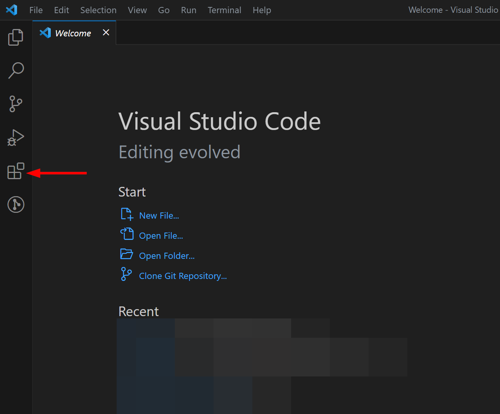
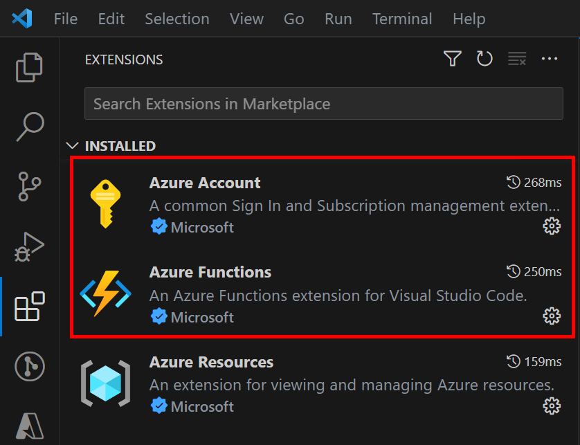
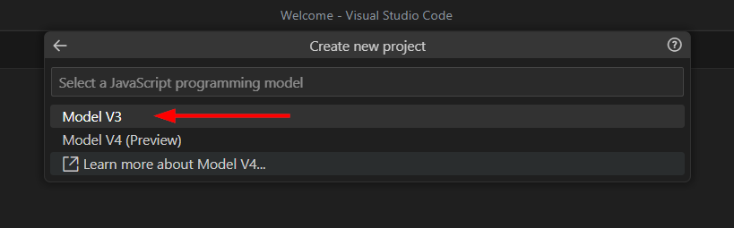
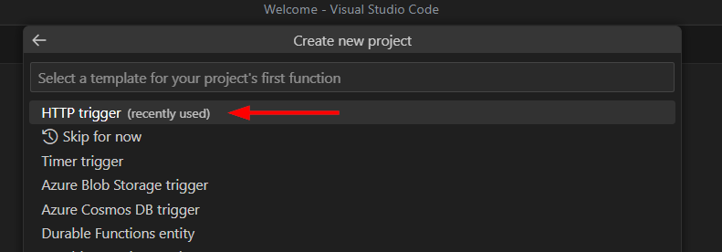
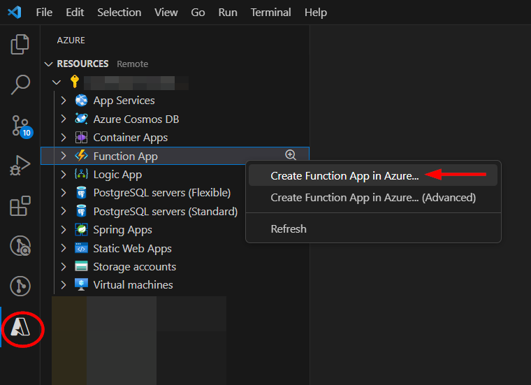

# AS-Block-GitHub-User

Author: Accelerynt

For any technical questions, please contact info@accelerynt.com  

       

This playbook is intended to be run from a Microsoft Sentinel Incident. It will look up the GitHub Users associated with the Incident Account Entities and block them from your GitHub Organization. If they are members of the GitHub Organization, they will also be removed. A comment noting the affected GitHub Users will be added to the Incident.

 
                                                                                                                                
#
### Requirements
                                                                                                                                     
The following items are required under the template settings during deployment: 

* A [GitHub App](https://github.com/Accelerynt-Security/AS-Block-GitHub-User#install-the-github-app) with permissions to read and write on Users in your GitHub Organization
* The [GitHub App Installation ID](https://github.com/Accelerynt-Security/AS-Block-GitHub-User#install-the-github-app)
* An [Encoded Private Key](https://github.com/Accelerynt-Security/AS-Block-GitHub-User#encode-the-private-key) for your GitHub App
* An [Azure Key Vault Secret](https://github.com/Accelerynt-Security/AS-Block-GitHub-User#create-an-azure-key-vault-secret) containing your encoded private key
* Install [Visual Studio Code](https://github.com/Accelerynt-Security/AS-Block-GitHub-User#configure-visual-studio-code) and configure it to deploy an Azure Function to your Azure tenant
* An [Azure Function App](https://github.com/Accelerynt-Security/AS-Block-GitHub-User#deploy-the-azure-function-app) that supports Node.js to deploy an Azure function to

# 
### Setup
                                                                                                                                     
#### Install the GitHub App:

A GitHub App with read and write permissions on Users is needed in order to perform the required 'Block User' action on your GitHub Organization's behalf. Additionally, read and write permissions on Members are also required, as Users that are also Members cannot be blocked until after their membership is revoked. Accelerynt has developed a GitHub App with the aforementioned access, which you can install in your GitHub Organization.

Sign in to a GitHub account that has owner access to your Organization, then navigate to the following page:

https://github.com/apps/as-github-block-user

From there, click "**Install App**".

Once the App has been installed, navigate to https://github.com/organizations/{YOUR_ORGANIZATION}/settings/apps/as-github-block-user and take note of the App ID in the "**General**" section, as it will be needed for deployment.

The GitHub App installation ID will also be needed for deployment, and this is different than the App ID mentioned above. Once the app has been installed, navigate to the "**Install App**" tab on the left menu blade of the app settings. From there, you should see your Organization listed as installed. Click the gear icon, which will take you to the app installation settings page.

Your App installation ID can be found in the URL of this page, as indicated.

This GitHub App will need to authenticate as an installation using a private key. Once the app has been installed, navigate to the "**General**" tab on the left menu blade of the app settings and scroll down to the "**Private keys**" section. Click "**Generate a private key**".

This will generate a new private key and the file will be downloaded automatically. This file will be needed in the next step.

#### Encode the Private Key:

To ensure the private key remains secure, this playbook utilizes Azure key vault to access the private key, rather than storing it directly in the playbook. However, because the file contains multiple line breaks, the contents of the file containing your private key will need to be encoded before it can be successfully stored in an Azure key vault.

A PowerShell script titled "**Encode-Private-Key.ps1**", located in the Encode-Private-Key folder of this repository,
will allow you to easily select your private key file and encode its contents.

#### Create an Azure Key Vault Secret:

Navigate to the Azure Key Vaults page: https://portal.azure.com/#view/HubsExtension/BrowseResource/resourceType/Microsoft.KeyVault%2Fvaults

Navigate to an existing Key Vault or create a new one. From the Key Vault overview page, click the "**Secrets**" menu option, found under the "**Settings**" section. Click "**Generate/Import**".

Choose a name for the secret, such as "**GitHub-App-Private-Key--Block-User**", and enter the App Registration Secret copied previously in the "**Value**" field. All other settings can be left as is. Click "**Create**". 

Once your secret has been added to the vault, navigate to the "**Access policies**" menu option on the Key Vault page menu. Leave this page open, as you will need to return to it once the playbook has been deployed. See [Granting Access to Azure Key Vault](https://github.com/Accelerynt-Security/AS-Block-GitHub-User#granting-access-to-azure-key-vault).

#### Configure Visual Studio Code:

This playbook utilizes an Azure Function to create a JSON Web Token (JWT), which is a required step in authenticating to GitHub as an application. The Azure Function is included in this repository and will need to be deployed to your Azure tenant before it can be used. This Azure Function relies on the Node.js libraries "**jsonwebtoken**" and "**date-fns**". These libraries are not included in Node.js by default, which is why they must be installed in an IDE housing the CreateJWT project and then deployed to Azure.

> **Note**
> Simply recreating the file structure from this repository in Azure will not actually install the libraries required for the Azure Function; the function must be deployed from an IDE, so that the dependent library packages are recreated and properly installed. Any IDE can be used for this, but this documentation will outline the process using Visual Studio Code (VS Code).

If you have not already, download and install VS Code from the official website: https://code.visualstudio.com/download

Once VS Code has been installed, open it, and navigate to the Extensions view by clicking on the Extensions icon on the left menu blade. 

In the Extensions view, search for the following extensions and install them:
    - **Azure Account**: This extension provides a single Azure login and subscription filtering experience for all other Azure extensions. It makes Azure's Cloud Shell service available in VS Code's integrated terminal.
    - **Azure Functions**: This extension helps in creating, testing, and deploying Azure Functions directly from VS Code. This includes the creation of new function apps within your Azure account.

After the extensions have been installed, sign in to your Azure Account. Click on the Azure icon that now appears in the Activity Bar. Under the "**Resources**" section, click "**Sign in to Azure...**". 

You will be prompted to sign in to your account via web browser. Follow the prompts and use your Azure credentials to log in.

Once you have successfully authenticated, your Azure email will be displayed in the bottom left corner of the VS Code window.

Next, you will need to create an Azure Function project using the code included in this GitHub repo. Create a folder on your computer for the Aure Function to be housed. Next, in VS Code, hover your mouse over the "**Workspace**" section in the Azure pane on the left. Click the "**Create Function**" icon. Select the "**CreateJWT**" folder you just created from the open dialogue window.

From the command palette in the tope-center area of the window, select "**JavaScript**" as the programming language, then select "**Model V3**" for your JavaScript programming model.

Select "**HTTP trigger**" for the project's function and enter "**CreateJWT**" for the function name.

Select "**Function**" for the Authorization level, then after selecting the window to open your project in and granting trust, you will be able to view the "**CreateJWT**" project in the explorer pane of the left side of the window. The "**index.js**" file should be opened by default.

>**Note**
> If you decide to use a different name for the function, you will need to do a -Find + Replace All- for "**CreateJWT**" in the azuredeploy.json file before deployment.

Replace the contents of "**index.js**" in VS Code with the contents of "**CreateJWT.js**" located in the CreateJWT-Function folder of this repository.

Finally, the Node.js packages used in index.js need to be installed. Download and install the latest versions of Node.js and npm from the official website: https://nodejs.org/en/download

Next, in VS Code, click "**Terminal**" from the top menu and select "**New Terminal**".

In the terminal window, run the commands "**node -v**" and "**npm -v**" to verify that the latest versions were properly installed.

Next, run the commands "**npm install jsonwebtoken**" and "**npm install date-fns**". The packages will be automatically added to the dependencies in the "**package.json**" file once they have been successfully installed.

After installing the required packages, the Azure Function can be deployed.

> **Note**
> Simply recreating the file structure from this repository in Azure will not actually install the libraries required for the Azure Function; the function must be deployed from an IDE, so that the dependent library packages are recreated and properly installed. Any IDE can be used for this, but this documentation will outline the process using Visual Studio Code (VS Code).

#### Deploy the Azure Function App:

In order to deploy an Azure Function, there must be an existing Azure Function App supporting the language used in the Azure function. If there is an existing Function App that supports Node.js in your Azure tenant, you can skip the first part of this step. Otherwise, you need to create a new Function App in your Azure tenant before deploying your Function.

Click on the Azure icon in the left side Activity Bar in VS Code. Select the resource you will deploy this playbook to, and then right click on "**Azure Function**" and select "**Create Function App in Azure...**".

VS Code will guide you through the process. You will need to provide a globally unique name for your Function App, select a runtime, and choose an operating system. When asked for the runtime, select the latest available runtime for Node.js.

The Azure Function can now be deployed to the Azure Function App from VS Code. 

Click back to the Explorer icon in the left side Activity Bar and right-click inside your project folder, then select "**Deploy to Function App...**". 

Follow the prompts to choose your subscription and the Function App to which you want to deploy to. Take note of the name of the Function App, as it will be needed for deployment.

Once the deployment is complete, the Function can be accessed from your Azure tenant by the playbook. You can view your Function by navigating to https://portal.azure.com/#view/HubsExtension/BrowseResource/resourceType/Microsoft.Web%2Fsites/kind/functionapp and selecting the Function App your Function was deployed to.

#
### Deployment                                                                                                         
                                                                                                        
To configure and deploy this playbook:
 
Open your browser and ensure you are logged into your Microsoft Sentinel workspace. In a separate tab, open the link to our playbook on the Accelerynt Security GitHub Repository:

https://github.com/Accelerynt-Security/AS-Block-GitHub-User

                                             

Click the "**Deploy to Azure**" button at the bottom and it will bring you to the custom deployment template.

In the **Project Details** section:

* Select the "**Subscription**" and "**Resource Group**" from the dropdown boxes you would like the playbook deployed to.  

In the **Instance Details** section:   

* **Playbook Name**: This can be left as "**AS-Block-GitHub-User**" or you may change it.

* **GitHub Organization Name**: Enter the name of your GitHub Organization

* **GitHub App ID**: Enter the name of your GitHub App ID noted in [Install the GitHub App](https://github.com/Accelerynt-Security/AS-Block-GitHub-User#install-the-github-app)

* **GitHub App Installation ID**: Enter the name of your GitHub App Installation ID noted in [Install the GitHub App](https://github.com/Accelerynt-Security/AS-Block-GitHub-User#install-the-github-app)

* **Function App Name**: Enter the name of your Azure Function App noted in [Deploy the Azure Function App](https://github.com/Accelerynt-Security/AS-Block-GitHub-User#deploy-the-azure-function-app)

* **Key Vault Name**: Enter the name of the Key Vault referenced in [Create an Azure Key Vault Secret](https://github.com/Accelerynt-Security/AS-Block-GitHub-User#create-an-azure-key-vault-secret).

* **Secret Name**: Enter the name of the Key Vault Secret created in [Create an Azure Key Vault Secret](https://github.com/Accelerynt-Security/AS-Block-GitHub-User#create-an-azure-key-vault-secret).

Towards the bottom, click on "**Review + create**". 

Once the resources have validated, click on "**Create**".

The resources should take around a minute to deploy. Once the deployment is complete, you can expand the "**Deployment details**" section to view them.
Click the one corresponding to the Logic App.

#
### Granting Access to Azure Key Vault

Before the Logic App can run successfully, the Key Vault connection created during deployment must be granted access to the Key Vault storing your App Registration Secret.

From the Key Vault "**Access policies**" page, click "**Create**".

Select the "**Get**" checkbox in the "**Secret permissions**" section. Then click "**Next**".

From the "**Principal**" page, paste "**AS-Block-GitHub-User**", or the alternative playbook name you used, into the search box and click the option that appears. Click "**Next**". 

* Note that if the same name is used for the app registration and playbook, you will see two options here, which can be hard to differentiate. In this case, you would want to select the option whose ID does **not** match the app registration (client) ID.

Click "**Next**" in the application section. Then from the "**Review + create**" page, click "**Create**".

#
### Microsoft Sentinel Contributor Role

After deployment, you will need to give the system assigned managed identity the "**Microsoft Sentinel Contributor**" role. This will enable the Logic App to add comments to Incidents. Navigate to the Log Analytics Workspaces page and select the same workspace the playbook is located in:

https://portal.azure.com/#view/HubsExtension/BrowseResource/resourceType/Microsoft.OperationalInsights%2Fworkspaces

Select the "**Access control (IAM)**" option from the menu blade, then click "**Add role assignment**".

Select the "**Microsoft Sentinel Contributor**" role, then click "**Next**".

Select the "**Managed identity**" option, then click "**Select Members**". Under the subscription the logic app is located, set the value of "**Managed identity**" to "**Logic app**". Next, enter "**AS-Block-GitHub-User**", or the alternative playbook name used during deployment, in the field labeled "**Select**". Select the playbook, then click "**Select**".

Continue on to the "**Review + assign**" tab and click "**Review + assign**".

